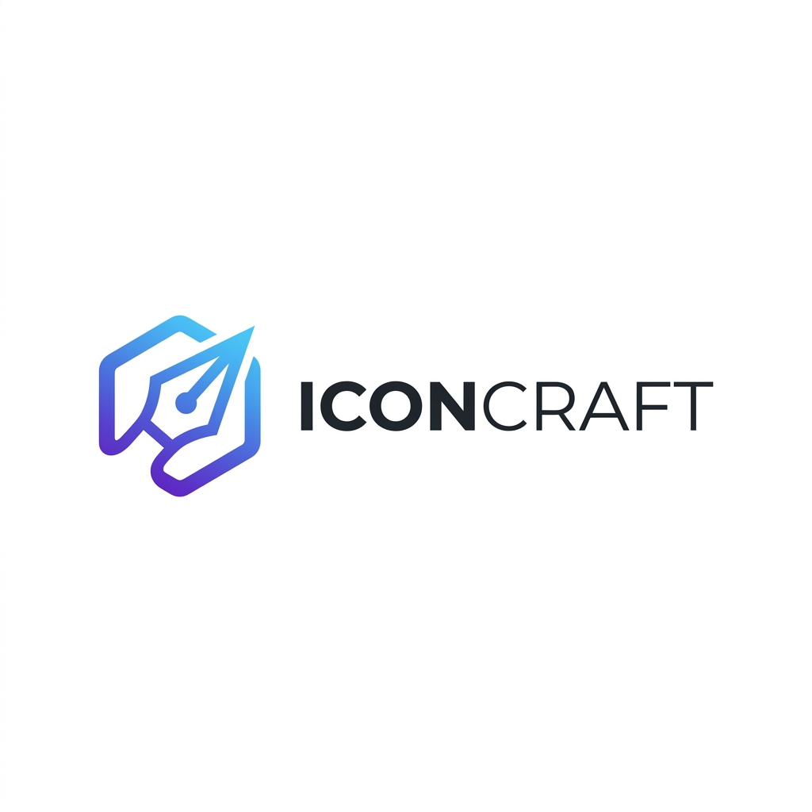
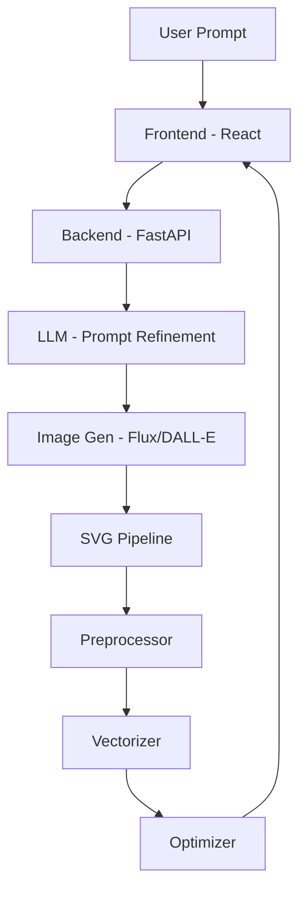

<p align="center">
  
</p>

<h1 align="center">IconCraft</h1>

<p align="center">
  <strong>AI-powered vector icon generation & optimization platform.</strong><br>
  Transform natural language descriptions into production-ready, optimized SVG icons.
</p>

<p align="center">
  
  
  
  
  
</p>

---

## 🚀 Overview

IconCraft is a full-stack platform designed to streamline the creation of vector icons using Artificial Intelligence. By leveraging state-of-the-art LLMs and Image Generation models, IconCraft converts text prompts into high-quality bitmap images, which are then processed through a specialized pipeline to produce clean, scalable, and optimized SVGs.

### ✨ Key Features

- **Natural Language to SVG**: Describe what you want, and get a vector icon.
- **Advanced Processing Pipeline**:
  - **Preprocessing**: Automatic background removal and color normalization.
  - **Vectorization**: High-fidelity bitmap-to-SVG conversion.
  - **Optimization**: SVG minification and path cleaning for production use.
- **Plugable Providers**: Support for OpenAI (DALL-E 3), Flux, DeepSeek, Anthropic, and more.
- **Interactive UI**: Real-time preview, style selection, and property adjustment.
- **MCP Integration**: Model Context Protocol support for seamless AI tool integration.

## 🛠️ Tech Stack

### Frontend
- **Framework**: React 18 with Vite
- **Styling**: Tailwind CSS + shadcn/ui
- **Icons**: Lucide React
- **State Management**: React Hooks + TypeScript (Strict)

### Backend
- **Core**: FastAPI (Python 3.12+)
- **Processing**: Pillow (Image handling), Rembg (Background removal)
- **Vectorization**: vtracer
- **Optimization**: Scour

### Infrastructure
- **Containerization**: Docker & Docker Compose

---

## 🚦 Getting Started

### Prerequisites
- Docker & Docker Compose
- Python 3.12+ (for local development)
- Node.js 18+ (for local development)

### Environment Setup
Copy the example environment file and fill in your API keys:
```bash
cp .env.example .env
```

| Variable | Description | Default |
|----------|-------------|---------|
| `LLM_API_KEY` | API Key for your LLM provider | - |
| `LLM_PROVIDER` | `openai`, `deepseek`, or `anthropic` | `openai` |
| `IMAGE_API_KEY` | API Key for image generation | - |
| `IMAGE_PROVIDER` | `flux` or `openai` | `flux` |

### Installation & Running

#### Using Docker (Recommended)
```bash
docker compose up --build
```
The application will be available at `http://localhost:3000` and the API at `http://localhost:8000`.

#### Manual Setup
**Backend:**
```bash
cd backend
pip install -r requirements.txt
uvicorn main:app --reload --port 8000
```

**Frontend:**
```bash
cd frontend
npm install
npm run dev
```

---

## 🏗️ Architecture



## 📄 License
This project is licensed under the MIT License.
